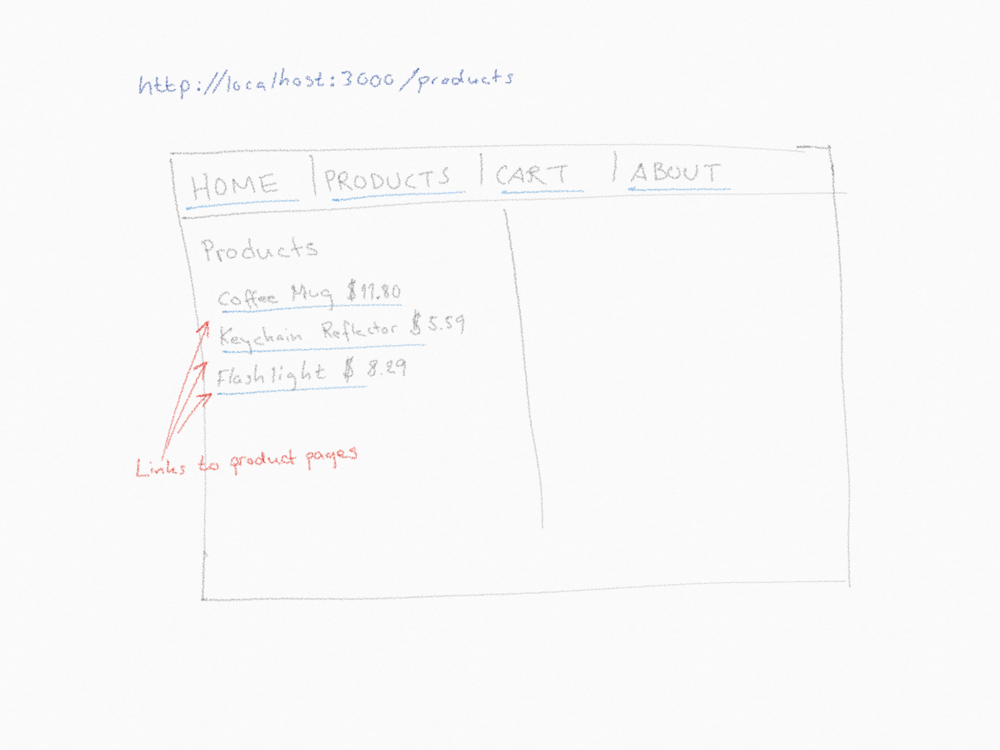

# Salt shopping - UI

In this exercise you will build a simple Web UI for the shopping API. The UI will be rendered on the server, per request.

You may use the API you previously built (you may use the completed API from the branch `api-complete` in the `salt-jsfs-shopping-api`-repository.

The UI you are about to build should be a server-side rendered UI and you will use [Handlebars](https://handlebarsjs.com/), which is an excellent template engine, to perform the task.

Note that this means that no rendering will take place on the client. You will build another Node server (using Express again) that **returns HTML** to the client. This HTML should have all the data injected in the right places, and we will use Handlebars to accomplish this.

The API that you built previously can be treated as a third party API that you call into using tools like `node-fetch` or `axios`, to get the data from the API you built. You can access the API on `http://localhost:3001/api`.

You should style the UI with some CSS, so that the menu looks good and the page is usable. But don't spend too much mob time on styling.

Spend time on the templating and the site-serving code, on  the server. Let the wireframes below guide both design and functionality.

As you see there's no server setup for you but you will have to create this project from scratch. Psst - start with `npm init -y` to get an initial `package.json`-file.

### Handlebars

The project is already prepared to use [Express Handlebars](https://github.com/ericf/express-handlebars). All you have to do is to require the module and to tell Express to use the handlebars view engine in your `app.js`:

```javascript
// other imports
const expressHandlebars = require('express-handlebars');

const app = express();

app.enable('etag');
app.engine('hbs', expressHandlebars({defaultLayout: 'main', extname: '.hbs'}));
app.set('view engine', 'hbs');

// Other middleware follows below...
```

See [Handlebars](https://handlebarsjs.com/) and [Express Handlebars](https://github.com/ericf/express-handlebars) for more documentation.

### Home Page

When a user enters the page for the first time, he/she should be presented with a top menu that contains links to the home/index page and an about page.
On the home page there should be a link to the web shop. Clicking that link should open a new session and take the user to the products page.


### Session

When a session is opened up, a new `cart` should be attached to the session. The top menu should also show links to the products page and to the current cart.


### Products

The products page should list all products in the database. The product names are all links pointing to a page for each item.

In a real world app, where whould probably be meny products in the database and the API would have support pagination. However, that's out of the scope of this exercise.

Clicking a product link should open up a product view to the right of the products list.
The Product page contains `Title`, `Description` and `Price`. It also lets the user add the product to the cart.


### Cart

The cart page should list all items added to the cart. It should have a _checkout button_ and a link back to the porducts page.


When the cart has been checked out, it should no longer be reachable from the UI, but the link to the page should still be valid. However checkout button and link to the products page should be removed from the cart view.


### About

The about page is a static page with some information about the shop. You are free to add whatever info you want to this page. But the top menu links must follow the session. That means that the products and carts links hould only be present if the user has started a new session and the session is active.

